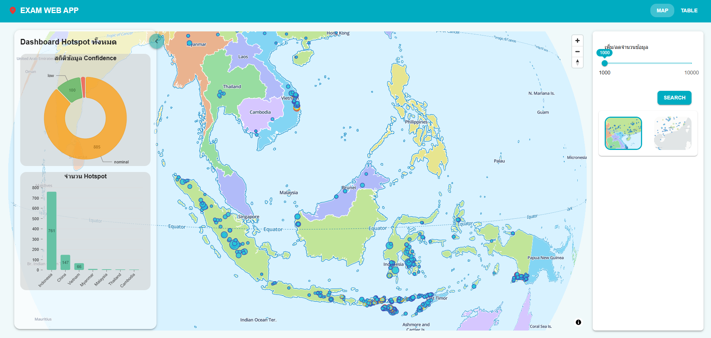
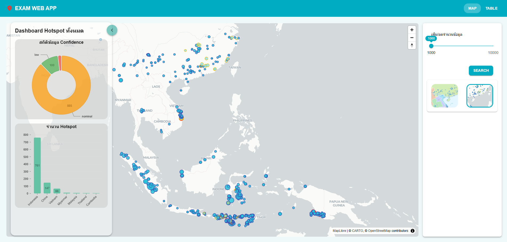

============================
**ส่งข้อสอบ Frontend (React)**
============================

เทคโนโลยีที่ใช้
Frontend: React  
UI: MUI  
Map: MapLibre  
Chart: Nivo  

ใช้ Limit / Offset ควบคุมจำนวนข้อมูล  
DataTable มี Pagination  

ตัวอย่างหน้าแสดงแผนที่จาก MapLibre 

============================

ตัวอย่างหน้าแสดงข้อมูลแบบตาราง (DataTable) พร้อม Pagination

============================
